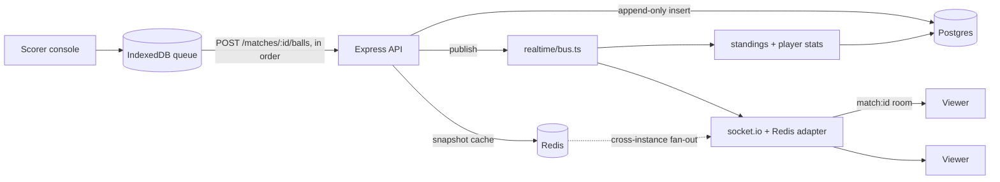

# Howzat — summary

- Problem: Club and street cricket is scored on paper or in a WhatsApp group. The people who want the score (parents, teammates, anyone off the ground) will not install an app or create an account to get it.
- Solution: One person gets a fast scoring console (one tap per ball, extras/wickets/undo, works offline) and everyone else gets a public no-login live share link over websockets. Organizers get fixtures, playoff bracket, self-computing points table with qualification scenarios. Players added off a team sheet get career profiles that fill in as matches complete.
- Tech: TypeScript strict monorepo (npm workspaces: `packages/shared`, `apps/api`, `apps/web`). Web: Vite + React 18 + Tailwind v4 with semantic CSS tokens (light/dark). API: Express + Prisma + Postgres (Neon) + Redis (Upstash) + Socket.IO with Redis adapter. Scoring writes are HTTP POST with `clientEventId` idempotency; realtime is read-only snapshot fan-out. Offline: IndexedDB queue replayed in order, shared reducer in `packages/shared`. Auth: bcrypt cost-12, 15-min in-memory JWT + rotating httpOnly refresh cookies, scoped email codes. Deploy: single Vercel project, one origin (SPA at `/`, API at `/api/*`, sockets at `/api/socket.io`).
- Link: https://github.com/whynotramaa/howzat
- Website: https://howzat-nitr.vercel.app (README badge points to https://howzat-zeta.vercel.app)

---

> Original README from https://github.com/whynotramaa/howzat below, kept verbatim.

<div align="center">

# Howzat

**Local cricket tournaments with live, ball-by-ball scoring — and a public share link that needs no login.**

[](https://howzat-zeta.vercel.app)


</div>

<div align="center">
  
  <br>
  <em>The public share link — no account, no app install. Just a URL.</em>
</div>

---

## The problem

Club and street cricket is scored on paper, in a WhatsApp group, or not at all.
The people who actually want the score — a parent, a teammate on their way to
the ground, someone who lost the toss and went home — are not going to install
an app or create an account to get it.

Howzat gives one person a fast scoring console and everybody else a link.

- **The scorer** taps runs. Every ball is an append-only event, and the console
  keeps working when the signal at the ground does not.
- **Everyone else** opens a URL. The score arrives over a websocket, live.
- **The organizer** gets fixtures, a playoff bracket, and a points table that
  computes itself — plus what each side still needs to qualify.
- **The players** are added off a team sheet in one flow, account or not, and a
  registered one gets a career profile that fills in as matches complete.

---

## Screenshots

<table>
<tr>
<td width="50%">

<p align="center"><strong>Scoring console</strong><br><sub>One tap per ball. Extras, wickets and undo are all one reach away, with keyboard shortcuts for a scorer who does this every week.</sub></p>
</td>
<td width="50%">

<p align="center"><strong>Points table</strong><br><sub>Recomputed from the innings records on every result, so it cannot drift. Every NRR input is shown, not just the figure.</sub></p>
</td>
</tr>
<tr>
<td width="50%">

<p align="center"><strong>Tournaments</strong><br><sub>Squad registration gates fixture generation — the UI states exactly what is still missing rather than failing later.</sub></p>
</td>
<td width="50%">

<p align="center"><strong>Light and dark</strong><br><sub>Semantic CSS variables, not <code>dark:</code> classes. Follows the OS by default; a manual choice wins and survives a reload.</sub></p>
</td>
</tr>
</table>

<div align="center">
  
  <p><strong>Notifications</strong> — scorers learn they have been assigned to a match without being told out of band.</p>
</div>

---

## How it works



**Scoring is HTTP, never websocket.** Auth, idempotency, validation and retry
semantics all live in one place, which leaves the realtime layer a disposable,
read-only fan-out. The write path publishes to `realtime/bus.ts` and never
imports socket.io.

**Every ball goes through the queue, online or not.** There is no separate
offline path to keep in step with the online one — the connection only decides
whether the queue drains now or later, and `clientEventId` makes the replay
indistinguishable from a first attempt.

**Postgres is the truth; Redis is derived.** `BallEvent` is append-only and is
the sole source of truth for anything that happens in a match. The snapshot in
Redis is a cache — delete it and the next read rebuilds the score by folding
the event log. Snapshot writes are guarded by `lastEventSeq`, so a slow write
can never overwrite a newer score.

**Broadcasts carry the whole snapshot, not a delta.** Slightly larger on the
wire, and self-healing: a client that misses one message is corrected by the
next, and `seq` monotonicity is enough to discard an out-of-order arrival. It
is also what lets a viewer join mid-match and see the current score
immediately, rather than a replay from ball one.

---

## Engineering notes

<details open>
<summary><strong>Correctness</strong></summary>

- **Overs are base-6.** `16.5 + 0.1` is `17.0`, not `16.6`. `PointsTable`
  stores *balls* and converts only at read time, which is what makes the NRR
  arithmetic hard to get subtly wrong.
- **The bowled-out rule.** A side dismissed inside its quota is charged the
  **full quota** of overs for NRR, not the balls it actually faced. There is a
  regression test proving the rule changes the answer.
- **DLS is derived, never stored.** The scorer records stoppages — overs left,
  wickets down, overs left on resumption — and the allotments, the par score
  and the revised target are recomputed from that list every time it changes.
  A stoppage typed wrong can be deleted and the match returns to exactly where
  it would have been. The resource table is the ICC's published Standard
  Edition; the Professional Edition is a licensed program nobody outside the
  licence can reimplement, and the Standard Edition is what the playing
  conditions themselves fall back to when it is not at the ground.
- **A DLS result changes NRR, not just the scoreboard.** The side batting first
  is deemed to have scored the par score off the chasing side's overs, per the
  ICC rule — charging it the runs it happened to make off the overs it happened
  to face would punish it for a chase that never ran its course.
- **The points table is recomputed, never incremented.** Every
  `match:completed` rebuilds the tournament from the event log in one
  transaction. Costlier than an increment, and it buys idempotency: replaying
  an event converges instead of double-counting.
- **Idempotent ball writes.** Each ball carries a `clientEventId`. Re-posting
  an identical body returns `200` with the same snapshot instead of `201`, so a
  flaky connection at the ground cannot double-count a six.
- **Undo is an event, not a delete.** `POST /matches/:id/balls/undo` appends an
  `UNDO`; `GET /matches/:id/events` still shows both. Nothing is destroyed.

</details>

<details>
<summary><strong>Scoring with no signal</strong></summary>

The console does not stop when the connection does. A ball scored offline is
queued in IndexedDB and replayed when the network returns; the scorer sees the
running score move immediately either way.

- **The queue is the same idempotency story as the write path.** Each queued
  ball is keyed by its `clientEventId`, so a replay is indistinguishable from
  the original attempt — which is the whole reason the queue is safe to drain
  blindly. The phone has no way to know whether its first attempt landed.
- **The drain is ordered and stops at the first failure.** Ball *n+1*'s legality
  depends on ball *n*; syncing past a rejection would post deliveries against a
  state the server never reached. Failed balls surface in the UI with the
  server's reason and can be retried explicitly.
- **The browser runs the same reducer the server does.** `packages/shared` is
  imported by both, so the offline score is folded by the code that will later
  validate it — not a second implementation that can disagree.
- **The previous over's bowler is carried through the fold.** Offline, the
  server's answer is frozen at the moment the connection dropped. A stale one
  offers the wrong bowlers at the over boundary and lets through a ball the
  server rejects with `CONSECUTIVE_OVERS` on sync — the failure would appear
  minutes later, against a ball the scorer had forgotten about.
- **Crease overrides clear against the *displayed* sequence, not the server's.**
  Offline the server's sequence never moves, so tracking against it would
  freeze the striker and the bowler for the rest of the innings.

</details>

<details>
<summary><strong>Security</strong></summary>

- **Sign up once, then username and password.** The email code is spent
  confirming the address, not gating every sign-in. Mailing a code each time
  reads as frictionless and is the opposite in the one place this app is used:
  a ground with bad signal, where the scorer's email is on a different device
  and the match is waiting on them. Passwords are bcrypt at cost 12.
- **Access tokens are 15-minute JWTs held in memory only** — never
  `localStorage`, so an XSS cannot exfiltrate one. The httpOnly refresh cookie
  is what survives a reload.
- **Refresh tokens are opaque random strings** stored as SHA-256 hashes and
  rotated on every use. Presenting an already-revoked token is treated as theft
  and revokes the user's entire session family.
- **Codes are scoped to what they were issued for.** A code emailed to confirm
  an address is not redeemable as a password reset, even though both are six
  digits sent to the same inbox. They are `crypto.randomInt`, stored hashed.
- **No enumeration oracles.** Every code failure path returns the same message,
  a login against a missing account still burns a password comparison, and
  handle lookup requires a session — a public "does this handle exist"
  endpoint would be an oracle.
- **`requireScorerForMatch`** guards every match route, with a 60s Redis cache
  invalidated the moment an assignment changes.
- Redis-backed rate limits on code requests and ball writes, with a truthful
  `Retry-After`. The per-IP ceiling is deliberately looser than the per-email
  one — a shared ground wifi should not lock out a whole team.

</details>

<details>
<summary><strong>Running on serverless</strong></summary>

The API is a long-lived Express server locally and a Vercel Function in
production. Three things that difference forced:

- **Websocket transport only.** Socket.IO defaults to HTTP long-polling, whose
  handshake is process-sticky: the session lives in one instance's memory and
  the next poll can land elsewhere, producing `session ID unknown`. Both ends
  pin `transports: ['websocket']`.
- **Viewers are counted in Redis, not by asking the other instances.** The
  adapter's `fetchSockets()` broadcasts a request and waits for every subscribed
  instance to answer — which never terminates well on a platform that *freezes*
  idle instances, because a frozen instance stays subscribed but cannot reply.
  A sorted set keyed by match, pruned by join timestamp, has no such dependency
  on who happens to be awake.
- **Event subscribers are awaited.** The instance is frozen the moment the
  response is sent, so a detached standings rebuild would be truncated
  part-way through with no error. `publishMatchEvent` returns a promise; the
  match-completion path awaits it, while the hot ball path still drops it.

</details>

---

## Getting started

### Prerequisites

Node 20+. Both datastores have free tiers and neither needs a local install.

- **Postgres — [Neon](https://neon.tech)**: copy *two* connection strings. The
  **pooled** one (host contains `-pooler`) is `DATABASE_URL`; the **direct**
  one is `DIRECT_URL`. Prisma migrations cannot run through the pooler, which
  is why both exist.
- **Redis — [Upstash](https://upstash.com)**: copy the `rediss://` URL (note
  the double *s* — it is TLS). Plain `redis://` is accepted and then dies,
  surfacing as a confusing `MaxRetriesPerRequestError`.

### Setup

```bash
npm install
cp .env.example .env
```

Fill in `DATABASE_URL`, `DIRECT_URL` and `REDIS_URL`, then generate the two
secrets:

```bash
node -e "console.log(require('crypto').randomBytes(48).toString('base64'))"
```

Leave `RESEND_API_KEY` blank — verification and password-reset codes are then
printed to the API log rather than emailed, which is the intended development
path.

```bash
npm run db:migrate      # first run asks for a name; "init" is fine
npm run db:seed
npm run dev             # API on :4000, web on :5173
```

### Seeded accounts

Sign in with the **handle and password** — all three share `howzat1234`, and
all three are seeded as verified so there is no code to hunt for in the log.

| Handle | Password | What they are |
| --- | --- | --- |
| `@organizer` | `howzat1234` | Owns both tournaments |
| `@whynotramaa` | `howzat1234` | Assigned to every IPL 2026 match |
| `@demoscorer` | `howzat1234` | Assigned to nothing, useful for testing 403s |

Nobody has a role column. Being an organizer means owning a tournament; being a
scorer means holding an assignment for a match. All three are also registered
players in a Sunday League side, so their career profiles fill in as matches
complete.

**IPL 2026** seeds 10 teams, 11 players each and 49 matches; **Sunday League
2026** is a 4-team sandbox. The seed is idempotent and never regenerates
fixtures for a tournament whose matches have started, so re-running it cannot
destroy scoring data. Squads are illustrative demo data, not real rosters.

---

## Deployment

Web and API ship as **one Vercel project on one origin** — the SPA at `/`, the
API at `/api/*`, sockets at `/api/socket.io`. Same-origin is what keeps the
`sameSite=strict` refresh cookie working and removes CORS from the picture.

```bash
npm run build           # API bundle + web static build
npx vercel --prod
```

`vercel.json` builds the API with tsup before the function is compiled, because
files under `api/` are transpiled individually and will not follow a relative
TypeScript import out of that directory.

> **Note** — on the free plan a function is capped at 300s, so a live-match
> websocket reconnects at least every five minutes. Measured: the connection
> held 315s, dropped with `transport close`, and reconnected 2s later with the
> viewer count intact. The client is snapshot-first, so this is invisible.

---

## Verification

`npm test` covers the pure logic — 45 tests across the scoring reducer, the
fixture generator's pairing guarantees, career aggregation, and the NRR
arithmetic including the plan's exact worked scenario.

The parts worth checking by hand:

| Check | Expected |
| --- | --- |
| Score a wide and a no-ball in an over | After six *submissions* the over reads `0.4`, not `0.6` |
| Re-post a ball with the same `clientEventId` | `200` with an identical snapshot; the score does not move |
| Same bowler two overs running | Rejected with `CONSECUTIVE_OVERS` |
| `DEL match:<id>` in Redis, then re-read the snapshot | Identical score, rebuilt from the event log |
| Open the share link mid-match in a fresh window | Current score immediately — never a replay from ball one |
| Kill the API with the live page open | Badge flips to "Reconnecting", then resyncs by refetching |
| Score an over with the network throttled to offline, then restore it | The score moves as you tap; the queue drains in order and the server lands on the same total |
| Go offline and try the same bowler two overs running | Rejected on the device, before it is ever queued |
| Run two API instances, score through one | The viewer on the other updates, via Redis pub/sub |
| Chase bowled out inside its quota | That row's `oversFaced` is the **full quota** |

---

## Layout

```
packages/shared/   types, zod schemas, constants — one contract for both apps
  src/scoring/reducer.ts   applyBall / buildState — the core of the system
  src/scoring/validate.ts  the legal-state guard, run before any write
  src/scoring/format.ts    base-6 overs, run rate, strike rate, economy
  src/fixtures/circle.ts   round-robin by the circle method (pure, no DB)
  src/fixtures/knockout.ts the four-slot playoff bracket, filled as feeders end
  src/nrr/index.ts         points + NRR, incl. the bowled-out quota rule (pure)
  src/dls/table.ts         the ICC Standard Edition resource table, unabridged
  src/dls/index.ts         resources, par and revised targets (pure)
  src/qualification/       bounded "can we still qualify" scenarios (pure)
  src/stats/career.ts      career totals from per-match rows (pure)

apps/api/          express + prisma + redis
  src/app.ts               createApp() — no listen(), so it is host-agnostic
  src/index.ts             long-lived server entry (local dev)
  src/vercel.ts            serverless entry — exports the server, never listens
  src/config/env.ts        zod-parsed process.env, throws at boot if incomplete
  src/lib/                 prisma, redis, logger, errors, lock, slug
  src/middleware/          requireAuth, requireScorerForMatch, rate limits
  src/modules/             auth, users, me, notifications, tournaments, teams,
                           players, fixtures, matches, scoring, snapshot,
                           standings, stats
  src/modules/public/      the no-auth share link surface (slug-addressed)
  src/realtime/bus.ts      transport-agnostic seam the write path publishes to
  src/realtime/io.ts       socket.io + Redis adapter, Redis-backed viewer count

apps/web/          vite + react + tailwind v4
  src/styles/tokens.css    semantic CSS variables; light/dark, no `dark:` classes
  src/lib/api.ts           fetch wrapper with silent token refresh
  src/lib/socket.ts        one shared socket per tab
  src/lib/offlineBallQueue.ts   IndexedDB queue for balls scored with no signal
  src/features/            auth, dashboard, organizer, matches, live, profile,
                           notifications

api/server.ts      the Vercel Function — re-exports the built server
```

## Scripts

| Command | What it does |
| --- | --- |
| `npm run dev` | API and web together |
| `npm run typecheck` | `tsc -b` across all three workspaces |
| `npm run lint` | ESLint |
| `npm test` | Vitest over the reducer, fixtures and NRR |
| `npm run build` | API bundle + web static build |
| `npm run db:migrate` | Create/apply a migration (uses `DIRECT_URL`) |
| `npm run db:seed` | Demo tournaments, teams, squads, accounts |
| `npm run db:studio` | Prisma Studio |
